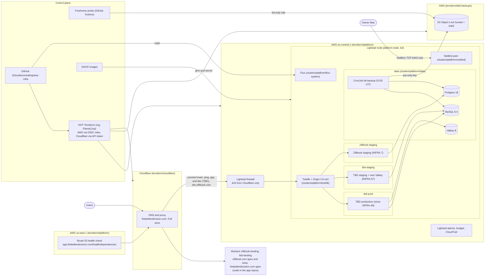

# Architecture

How the FJ Consulting apps (TBD, Ziftbook) run, end to end. This page is the map; each section
links to the README or manifest that holds the detail. Change the diagram in the same PR as the
infrastructure it describes.



## Ingress

Proxied hostnames go through Cloudflare to the node's static IP: `ping.thebetterdecision.com` and, since the
INFRA-48 cutover, `app.thebetterdecision.com` (TBD production, a proxied CNAME to `ping`). The thebetterdecision.com zone is in Full
(strict), so Cloudflare only accepts a Cloudflare Origin CA certificate from Traefik. ziftbook.com is in Full
(strict) too, with `dev.ziftbook.com` (Ziftbook staging) as its one proxied host on the node. An Origin CA
certificate covers one zone, so `TLSStore default` holds one per zone (`origin-cert` for thebetterdecision.com as the
default, `origin-cert-ziftbook` for ziftbook.com) and Traefik picks by SNI; adding a host or zone:
[runbooks.md](runbooks.md#add-a-public-hostname-for-an-app). The Lightsail firewall allows 443 from the Cloudflare IPv4 ranges only, so
the origin cannot be reached directly. `ping.thebetterdecision.com/ping` is a proxied health
endpoint served by Traefik itself (the uptime check's target before INFRA-48; now `app.../health/dependencies`). The ziftbook.com apex and www are a Cloudflare Worker (`ziftbook-landing`), and since INFRA-61 the
thebetterdecision.com apex is the Worker `tbd-landing`; their code and deploys live in the app repos, and their custom
domains are attached by hand ([configuration-map.md](configuration-map.md#worker-and-snippet-access-infra-98)).
`www.thebetterdecision.com` is a proxied record that a redirect rule in `terraform/cloudflare` sends to the apex (301).

Both app zones rate-limit the apps' sign-in and token endpoints at the edge (INFRA-123): more than 20 requests in 10 s
from one IP (per Cloudflare data center) to those paths gets a 429 from Cloudflare for 10 s, which caps the volume one
address can send to them. The zones are on the Free plan, which allows one such rule per zone and matches on the path only,
so the rule covers every proxied host of the zone. Each app keeps its own per-account and per-address limits behind it.

- Terraform: [`terraform/cloudflare/main.tf`](../terraform/cloudflare/main.tf), rate limit in
  [`terraform/cloudflare/rate_limit.tf`](../terraform/cloudflare/rate_limit.tf), firewall in
  [`terraform/platform/main.tf`](../terraform/platform/main.tf)
- Traefik: [`clusters/platform/traefik/traefik.yaml`](../clusters/platform/traefik/traefik.yaml)

## Node and k3s

One Lightsail `medium_3_0` (4 GB, 2 GB swap) in eu-central-1 runs single-node k3s, with daily
snapshots at 03:00 UTC. It has `prevent_destroy` and ignores `user_data` changes, because
replacing it destroys the databases. There is no EKS, RDS, ALB or NAT; the cost ceiling is about
$26/month on credits. Details and owner steps: [`terraform/platform/README.md`](../terraform/platform/README.md).

## Namespaces and quotas

| Namespace | Holds | Memory quota (requests / limits) | Notes |
|---|---|---|---|
| `tbd-prod` | TBD | 640Mi / 1Gi | Pod Security restricted; TBD production since the INFRA-48 cutover (scheduler: exactly one pod) |
| `tbd-staging` | TBD staging (`dev.thebetterdecision.com`), with its own Valkey | 320Mi / 768Mi | PriorityClass `staging`, enforced by a quota; no scheduler pod (INFRA-67) |
| `ziftbook-staging` | Ziftbook staging | 512Mi / 1Gi | PriorityClass `staging` (-100, never preempts), enforced by a quota |
| `data` | MySQL, Postgres, Valkey, backups | 1Gi / 1536Mi | Excluded from Flux pruning |
| `netbird` | NetBird peer, `owner-admin` | none | Pod Security privileged (hostNetwork) |
| `observability` | Grafana Alloy (metrics to Grafana Cloud, INFRA-85) | none (request 128Mi, limit 256Mi) | Pod Security privileged (read-only hostPath for node metrics) |

The app namespaces enforce Pod Security restricted, `data` baseline. Every app namespace has a LimitRange with default memory limits, and its `default`
ServiceAccount pulls from GHCR through `ghcr-pull`. Manifests:
[`clusters/platform/namespaces/`](../clusters/platform/namespaces/).

## Data stores

All run in `data` as StatefulSets on local-path volumes, images pinned by digest.

| Store | For | Key settings |
|---|---|---|
| MySQL 8.4 | TBD (`tbd`, users `tbd_app`, `tbd_backup`); TBD staging (`tbd_staging`, user `tbd_staging`, grants on its own database only, 20 connections at most) | buffer pool 128M, performance_schema off, binlog off |
| Postgres 18 | Ziftbook (`ziftbook`; roles created by Ziftbook's pinned `bootstrap.sql`, run as a Job) | shared_buffers 64MB, no parallel workers |
| Valkey 8 | TBD only: sessions, auth nonces, rate limits, locks (the exception in [Jobs, locks, sessions and rate limits](#jobs-locks-sessions-and-rate-limits)) | 64mb, noeviction, AOF on (not migrated at cutover) |

A NetworkPolicy denies ingress to `data` by default: MySQL accepts `tbd-prod` and `tbd-staging`, Valkey `tbd-prod` only, Postgres
accepts `ziftbook-staging`, and the backup and bootstrap pods reach their databases inside `data`.
Traffic from the node itself (kubelet probes, hostNetwork pods) bypasses the policy; database auth
and the NetBird ACL guard that path.
Manifests and comments: [`clusters/platform/data/`](../clusters/platform/data/).

## Jobs, locks, sessions and rate limits

One standard for every app and environment (decided in INFRA-102): this state lives in the app's own
database, MySQL or Postgres. No app gets Valkey or Redis for it. Ziftbook is the reference
implementation.

| Concern | Standard | Postgres | MySQL 8.4 |
|---|---|---|---|
| Background jobs | A `jobs` table, indexed on `next_attempt_at`. Enqueue in the caller's transaction with a dedupe key; claim a batch with `FOR UPDATE SKIP LOCKED`; the bumped `next_attempt_at` is both the lease and the backoff; attempts are capped. Handlers must be safe to repeat | One `UPDATE ... RETURNING` (Ziftbook `backend/app/jobs.py`) | `SELECT ... FOR UPDATE SKIP LOCKED`, then `UPDATE`, in one READ COMMITTED transaction (REPEATABLE READ gap locks would block enqueues). No `RETURNING`; no subquery on the table being updated. Dedupe with `INSERT ... ON DUPLICATE KEY UPDATE id = id` |
| Periodic work | A loop in the worker only when each tick claims its rows (`SKIP LOCKED`) or holds a lease, since every replica runs it; otherwise one scheduler Deployment with `replicas: 1` and `Recreate` | | |
| Migration lock | A session-level lock held by the migrating connection | `pg_advisory_lock` | `GET_LOCK('<app>_migrate.<db>')` |
| Short locks (inside one transaction) | Lock the business row `FOR UPDATE` | `pg_advisory_xact_lock` is fine too | No transaction-scoped `GET_LOCK`: lock a row |
| Leases (held across requests, an external call or a long tick) | A lease row, inserted once by a migration. Acquire and renew with `UPDATE ... SET holder = ?, expires_at = <db now> + ttl WHERE name = ? AND (expires_at < <db now> OR holder = ?)`: 1 matched row means held. Renew before each side effect and stop when a renew fails. Never a session-level lock on a pooled connection: the pool keeps it or loses it silently | `now()` | `NOW(6)` on a `DATETIME(6)` column (whole seconds make a same-second renew match but change nothing, which some drivers report as 0 rows) |
| Sessions | An opaque random token in the cookie, only its hash in a `sessions` table; idle and absolute expiry checked on every read; revoking deletes the row | Ziftbook `backend/app/auth.py` | |
| Rate limits | A fixed window per key in a `rate_limits` table, one upsert per attempt in its own transaction, committed before the request runs (a failed login must not roll back its count), keys locked in sorted order. A database error fails the request: never fail open | Ziftbook `backend/app/limits.py` | `ON DUPLICATE KEY UPDATE` assigns left to right: set `hits` before `window_start` |
| Single-use tokens, nonces, webhook dedupe | A row with a unique key and `expires_at`; a duplicate key means a replay. Purged by the sweeper | | A plain `INSERT`, catching error 1062 (not `ON DUPLICATE KEY UPDATE`, which hides the replay) |
| Caches | None. An in-process TTL cache when a measured need appears; the database stays the source of truth | | |

Why the database and not Valkey:

- **One failure domain.** Valkey is a second one, with its own outages (on 2026-05-13 its timeouts
  turned every TBD auth endpoint into a 500). A limiter in the database fails together with the user
  lookup, so it never has to choose between failing open and failing closed (INFRA-121).
- **Backups.** The nightly dump covers the database. Valkey is not dumped: its state lives only in
  its AOF and the node snapshot.
- **Memory and pods.** No extra pod per app and environment. A shared Valkey is not safe (below), so
  every environment would need its own, as tbd-staging will (INFRA-67).
- **Both engines.** Every row in the table works on MySQL 8.4 and Postgres 18; the column on the right
  lists the dialect differences.

Costs, accepted:

- One committed write per auth attempt on the shared database. A Cloudflare rate-limit rule in front
  of every app's auth endpoints absorbs bursts first (INFRA-123).
- Each replica's connection pool now carries sessions and limits too. Cap every app's pool so that
  replicas x pool stays under the server's `max_connections` before HPA (INFRA-100).
- After a real restore, delete every session row and every single-use link (Ziftbook `email_tokens` and
  invite links): sessions signed out and links used or revoked after the dump would otherwise come back
  ([RESTORE.md](../clusters/platform/data/RESTORE.md#6-real-restore-into-data)).

**A shared Valkey is not an option.** Valkey 8 ACL key patterns (`~tbd:*`) can confine
reads and writes, but `KEYS`, `SCAN`, `FLUSHDB` and `FLUSHALL` take no key argument and must be denied one
by one. Database rules (`db=<id>`) exist only from Valkey 9.1.0
([ACL SETUSER history](https://valkey.io/commands/acl-setuser/)). Neither helps with what stays
instance-wide: `maxmemory` with `noeviction`, the single command thread, AOF rewrites. One app filling
the store fails the other app's writes, and TBD's sessions fail closed, so its logins go down.

**The exception: TBD.** TBD keeps Valkey (sessions with Lua rotation and reuse detection, MFA nonces,
rate limits and throttles, locks, dedupe keys, one cache) until it moves:

1. INFRA-121: rate limits move to MySQL first, so they no longer fail open.
2. INFRA-122: sessions and the remaining keys move to MySQL, then Valkey is removed in prod and
   staging. About 3 to 5 days; no fixed sprint.

A new app that wants Valkey needs a measured reason in its PR (for example invalidation that must
reach every replica), and then gets one per environment, never shared.

## Backups and restore

- Nightly at 02:00 UTC, CronJob `db-backup` dumps MySQL then Postgres and uploads each set (dump,
  grants, manifest last) to the Object Lock bucket under `tbd-mysql/`, `tbd-staging-mysql/` and `ziftbook-postgres/`.
  It uses a put-only IAM user (`k3s-backup-uploader`), SSE-KMS and a SHA256 checksum. Objects are
  locked for 7 days (GOVERNANCE).
- A GitHub Actions probe at 04:17 UTC checks each backup prefix, each with its own size floor, and
  opens a `[backup-stale]` issue when one is stale.
- Lightsail snapshots at 03:00 UTC cover the whole node.
- Restore: [`clusters/platform/data/RESTORE.md`](../clusters/platform/data/RESTORE.md), restore drill (steps 1-5) passed 2026-10-02 (INFRA-31).

Bucket, KMS, IAM boundaries and owner steps: [`terraform/tbd-backups/README.md`](../terraform/tbd-backups/README.md).
Job: [`clusters/platform/data/db-backup.yaml`](../clusters/platform/data/db-backup.yaml).

## Access

kubectl and the flux CLI reach the node over NetBird only (Flux in the cluster pulls from public
GitHub over HTTPS). The node is a NetBird peer, and the NetBird
policy allows owner devices to reach TCP 6443 and nothing else. Authentication uses tokens of the
ServiceAccount `netbird/owner-admin`. Runbook (setup, new device, renew, revoke):
[`clusters/platform/netbird/README.md`](../clusters/platform/netbird/README.md). SSO through
NetBird's API server proxy is being evaluated (INFRA-71). SSH to the node goes through the
Lightsail browser console.

## Mail

Mailgun HTTP API (SDK `mailgun-python`), EU region, for every app and environment; no SMTP and no mail server in the
cluster. Dev and staging environments of every app share the sending domain `m.fjconsulting.dev`, each with its own
send-only sending key in its own Secret; production gets `m.<appdomain>` per app. DNS for both is in
`terraform/cloudflare`. Procedures: [runbooks.md](runbooks.md#mail-mailgun).

## Telemetry

One standard for every app and environment (decided in INFRA-84; adoption tickets INFRA-105 for TBD and INFRA-106 for
Ziftbook). Each app owns its OpenTelemetry SDK setup and every span; FastAPI's native telemetry supplies only the
HTTP metrics.

| Signal | How | Library |
|---|---|---|
| Traces | The app's own `tracing.py` (the Ziftbook pattern): the HTTP SERVER span in a middleware, SQL spans from SQLAlchemy engine events, job, worker and migration spans | `opentelemetry-sdk` and the OTLP HTTP exporter, no contrib instrumentation packages |
| Metrics | FastAPI native: `http.server.request.duration` and `http.server.active_requests` | the app registers a global `MeterProvider` before `FastAPI()` is built |
| Logs | JSON lines on stdout with `request_id`, `trace_id`, `span_id`; no OTLP log export from the app | stdlib `logging` (the Ziftbook `logs.py` pattern) |

Every app builds FastAPI with:

```python
FastAPI(telemetry={"tracing": False, "metrics": True, "logs": False, "operation_spans": False,
                   "auto_configure": False, "exclude": lambda scope: scope["path"] in HEALTH_PATHS})
```

Rules every app keeps (traces and logs alike):

- **Attributes are an allowlist.** The SERVER span carries `http.request.method`, `http.route`,
  `http.response.status_code` and `error.type` only. Never `url.path` or `url.query`: they carry invite tokens, OAuth
  codes and customer emails. SQL spans carry the statement, never its parameters, and values are always bound, never
  formatted into SQL text.
- **No exception messages.** `record_exception=False` on every span; an error is its class (plus SQLSTATE and
  constraint for a database error) and its frames, never `str(error)`, which can quote an email. The same holds for log
  records, including the `sys` and `threading` excepthooks.
- **Access logs carry no path, query or client IP:** method, route template, status, duration and the correlation
  ids. uvicorn's own access line (raw path with query, client IP) stays disabled.
- **`traceparent` only.** The app extracts and injects with a hard-coded `TraceContextTextMapPropagator`, reading only
  the `traceparent` header; never baggage or `tracestate`, which are client-controlled text that would ride into the
  jobs table. `OTEL_PROPAGATORS=tracecontext` is a backstop for the global propagator, not the guarantee.
- **Native tracing, logs and operation spans stay off.** Native tracing always exports the request path and query
  (only five cloud-signature parameters redacted), and native logs export exception messages. `auto_configure` stays
  off because it adds a second exporter to a provider the app already configured.

Environment for every process (`<role>` is `api`, `worker` or `migrations`):

| Variable | Value |
|---|---|
| `OTEL_SERVICE_NAME` | `<app>-<role>` |
| `OTEL_RESOURCE_ATTRIBUTES` | `service.namespace=<app>,deployment.environment.name=<prod or staging>,service.version=<version>` |
| `OTEL_EXPORTER_OTLP_ENDPOINT` | the in-cluster collector (INFRA-85); `http://127.0.0.1:4318` for the local LGTM stack |
| `OTEL_EXPORTER_OTLP_PROTOCOL` | `http/protobuf` |
| `OTEL_PROPAGATORS` | `tracecontext` |
| `OTEL_METRIC_EXPORT_INTERVAL` | `60000` |
| `OTEL_LOGS_EXPORTER` | `none` |

Export path (built by INFRA-85): apps send OTLP over HTTP to one Grafana Alloy DaemonSet in the cluster, which
forwards metrics (and, as each app adopts this standard, traces) to the Grafana Cloud OTLP gateway, and scrapes the
node and cAdvisor (`/metrics/cadvisor` only: k3s kubelet `/metrics` carries the whole control plane, about 58k series).
Tailing pod stdout into Grafana Cloud Logs comes later, under the rules below. One collector, so the Grafana Cloud
credentials (a write-only access policy token for an EU stack) live in one SOPS Secret. A DaemonSet never runs two
copies during a rollout. Not the `k8s-monitoring` Helm chart, which deploys several Alloys plus node-exporter and
kube-state-metrics. Measured by INFRA-85 against the real cAdvisor payload: 52 to 100 MiB working set (request 128Mi,
limit 256Mi).

The collector is the second line of defense, not the first:

- It tails logs only from an allowlist of app namespaces, and from each app only after that app has adopted this
  standard (TBD after INFRA-105, which disables its raw access line). Never `data`: Postgres logs row values on
  constraint errors.
- It deletes `url.path`, `url.query`, `url.full`, `client.address`, `http.request.header.*` and `exception.message`
  from every span before export.
- Grafana Labs becomes a sub-processor for whatever reaches it; the apps' privacy documents must name it.

Known cost: the SERVER span lives in an `@app.middleware("http")` middleware, which ends it before FastAPI records the
duration metric, so histogram exemplars do not link to traces (a pure ASGI middleware would fix it). Revisit native
tracing when FastAPI can leave out the path and query.

## Secrets

Kubernetes Secrets live in git as `*.secret.yaml`, SOPS-encrypted to the cluster's age key, and
Flux decrypts them in the cluster. CI fails on any unencrypted Secret. Terraform secrets are
sensitive HCP Terraform variables. Procedures never display secret values: see
[README.md, Kubernetes secrets](../README.md#kubernetes-secrets) and
[runbooks.md](runbooks.md#write-or-rotate-a-kubernetes-secret) (a new file needs only the public key).

## Infrastructure as code

- **Terraform:** every `terraform/<stack>/` is an HCP Terraform workspace with VCS flow: plan on
  the PR, apply on merge after approval in the TFC UI. The stacks are `platform` (node, alarms,
  budget, CloudTrail, uptime check), `cloudflare` (DNS, zone settings), `tbd-backups` (backup
  chain). `platform` and `tbd-backups` assume OIDC roles whose policies root mints once from [`aws/bootstrap/`](../aws/bootstrap/), so those
  workspaces never manage their own roles. `cloudflare` uses an API token.
- **Kubernetes:** Flux (source and kustomize controllers) applies `clusters/platform` from `main`.
- **CI** ([`.github/workflows/ci.yml`](../.github/workflows/ci.yml)): `terraform fmt` and validate,
  tflint, the tbd-backups fences check, kubeconform, the SOPS check and the Python tests.

## Monitoring and alerts

| Signal | Source | Goes to |
|---|---|---|
| CPU burst credits low, status check failed | Lightsail alarms | email (Lightsail contact) |
| Public endpoint down | Route 53 health check, alarm in us-east-1 | SNS `platform-alerts-use1`, email |
| Spend | AWS budget `platform-monthly` | SNS `platform-alerts`, email |
| Stale backup | freshness probe | GitHub issue `[backup-stale]` |

There is no in-cluster observability stack yet; INFRA-85 adds the Alloy collector from [Telemetry](#telemetry).

## Cost

About $24/month for the Lightsail node, about $2.75/month for the HTTPS health check, about
$1/month for the backup KMS key, and small amounts for S3 (backups, CloudTrail) and SNS. These are
expected to draw on AWS credits; whether credits apply to Lightsail is not confirmed. Credit
balances:
[README.md, AWS credits](../README.md#aws-credits-account-884686184019).
