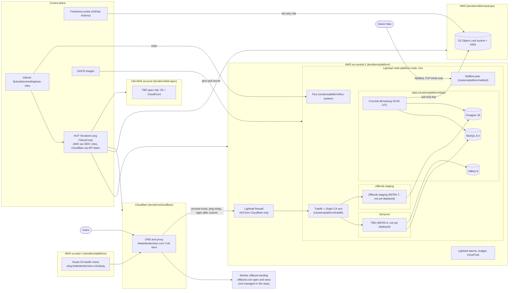

# Architecture

How the FJ Consulting apps (TBD, Ziftbook) run, end to end. This page is the map; each section
links to the README or manifest that holds the detail. Change the diagram in the same PR as the
infrastructure it describes.

## Ingress

Proxied hostnames go through Cloudflare to the node's static IP. Today that is only
`ping.thebetterdecision.com`; the TBD app records stay DNS-only to DigitalOcean until cutover
(INFRA-48), after which they are proxied the same way. The thebetterdecision.com zone is in Full
(strict), so Cloudflare only accepts the Cloudflare Origin CA certificate that Traefik serves as its
default (`TLSStore default`). ziftbook.com stays on Cloudflare's Automatic SSL/TLS mode until it gets
a proxied host on the node. The Lightsail firewall allows 443 from the Cloudflare IPv4 ranges only, so
the origin cannot be reached directly. `ping.thebetterdecision.com/ping` is a proxied health
endpoint served by Traefik itself. The ziftbook.com apex and www are a Cloudflare Worker (`ziftbook-landing`), managed outside this
repo.

- Terraform: [`terraform/cloudflare/main.tf`](../terraform/cloudflare/main.tf), firewall in
  [`terraform/platform/main.tf`](../terraform/platform/main.tf)
- Traefik: [`clusters/platform/traefik/traefik.yaml`](../clusters/platform/traefik/traefik.yaml)

## Node and k3s

One Lightsail `medium_3_0` (4 GB, 2 GB swap) in eu-central-1 runs single-node k3s, with daily
snapshots at 03:00 UTC. It has `prevent_destroy` and ignores `user_data` changes, because
replacing it destroys the databases. There is no EKS, RDS, ALB or NAT; the cost ceiling is about
$26/month on credits. Details and owner steps: [`terraform/platform/README.md`](../terraform/platform/README.md).

## Namespaces and quotas

| Namespace | Holds | Memory quota (requests / limits) | Notes |
|---|---|---|---|
| `tbd-prod` | TBD | 512Mi / 768Mi | |
| `ziftbook-staging` | Ziftbook staging | 256Mi / 512Mi | PriorityClass `staging` (-100, never preempts), enforced by a quota |
| `data` | MySQL, Postgres, Valkey, backups | 1Gi / 1536Mi | Excluded from Flux pruning |
| `netbird` | NetBird peer, `owner-admin` | none | Pod Security privileged (hostNetwork) |

`tbd-prod`, `ziftbook-staging` and `data` enforce Pod Security baseline. Every app namespace has a LimitRange with default memory limits, and its `default`
ServiceAccount pulls from GHCR through `ghcr-pull`. Manifests:
[`clusters/platform/namespaces/`](../clusters/platform/namespaces/).

## Data stores

All run in `data` as StatefulSets on local-path volumes, images pinned by digest.

| Store | For | Key settings |
|---|---|---|
| MySQL 8.4 | TBD (`pfv2`, users `pfv_app`, `pfv_backup`) | buffer pool 128M, performance_schema off, binlog off |
| Postgres 18 | Ziftbook (`ziftbook`; roles created by Ziftbook's pinned `bootstrap.sql`, run as a Job) | shared_buffers 64MB, no parallel workers |
| Valkey 8 | TBD sessions | 64mb, noeviction, AOF on (not migrated at cutover) |

A NetworkPolicy denies ingress to `data` by default: MySQL and Valkey accept `tbd-prod`, Postgres
accepts `ziftbook-staging`, and the backup and bootstrap pods reach their databases inside `data`.
Traffic from the node itself (kubelet probes, hostNetwork pods) bypasses the policy; database auth
and the NetBird ACL guard that path.
Manifests and comments: [`clusters/platform/data/`](../clusters/platform/data/).

## Backups and restore

- Nightly at 02:00 UTC, CronJob `db-backup` dumps MySQL then Postgres and uploads each set (dump,
  grants, manifest last) to the Object Lock bucket under `tbd-mysql/` and `ziftbook-postgres/`.
  It uses a put-only IAM user (`k3s-backup-uploader`), SSE-KMS and a SHA256 checksum. Objects are
  locked for 7 days (GOVERNANCE).
- The droplet still writes `pfv-data-01/` until it is retired (INFRA-49).
- A GitHub Actions probe at 04:17 UTC checks all three prefixes, each with its own size floor, and
  opens a `[backup-stale]` issue when one is stale.
- Lightsail snapshots at 03:00 UTC cover the whole node.
- Restore: [`clusters/platform/data/RESTORE.md`](../clusters/platform/data/RESTORE.md), drilled 2026-10-02 (INFRA-31).

Bucket, KMS, IAM boundaries and owner steps: [`terraform/tbd-backups/README.md`](../terraform/tbd-backups/README.md).
Job: [`clusters/platform/data/db-backup.yaml`](../clusters/platform/data/db-backup.yaml).

## Access

kubectl and the flux CLI reach the node over NetBird only (Flux in the cluster pulls from public
GitHub over HTTPS). The node is a NetBird peer, and the NetBird
policy allows owner devices to reach TCP 6443 and nothing else. Authentication uses tokens of the
ServiceAccount `netbird/owner-admin`. Runbook (setup, new device, renew, revoke):
[`clusters/platform/netbird/README.md`](../clusters/platform/netbird/README.md). SSO through
NetBird's API server proxy is being evaluated (INFRA-71). SSH to the node goes through the
Lightsail browser console.

## Secrets

Kubernetes Secrets live in git as `*.secret.yaml`, SOPS-encrypted to the cluster's age key, and
Flux decrypts them in the cluster. CI fails on any unencrypted Secret. Terraform secrets are
sensitive HCP Terraform variables. Procedures never display secret values: see
[README.md, Kubernetes secrets](../README.md#kubernetes-secrets).

## Infrastructure as code

- **Terraform:** every `terraform/<stack>/` is an HCP Terraform workspace with VCS flow: plan on
  the PR, apply on merge after approval in the TFC UI. The stacks are `platform` (node, alarms,
  budget, CloudTrail, uptime check), `cloudflare` (DNS, zone settings), `tbd-backups` (backup
  chain) and `tbd-apex` (TBD apex site in the old account). `platform` and `tbd-backups` assume
  OIDC roles whose policies root mints once from [`aws/bootstrap/`](../aws/bootstrap/), so those
  workspaces never manage their own roles. `cloudflare` uses an API token. `tbd-apex` manages its
  own provisioner role and OIDC providers in the old account (see its README).
- **Kubernetes:** Flux (source and kustomize controllers) applies `clusters/platform` from `main`.
- **CI** ([`.github/workflows/ci.yml`](../.github/workflows/ci.yml)): `terraform fmt` and validate,
  tflint, the tbd-backups fences check, kubeconform, the SOPS check and the Python tests.

## Monitoring and alerts

| Signal | Source | Goes to |
|---|---|---|
| CPU burst credits low, status check failed | Lightsail alarms | email (Lightsail contact) |
| Public endpoint down | Route 53 health check, alarm in us-east-1 | SNS `platform-alerts-use1`, email |
| Spend | AWS budget `platform-monthly` | SNS `platform-alerts`, email |
| Stale backup | freshness probe | GitHub issue `[backup-stale]` |

There is no in-cluster observability stack; the node has no memory to spare.

## Cost

About $24/month for the Lightsail node, about $2.75/month for the HTTPS health check, about
$1/month for the backup KMS key, and small amounts for S3 (backups, CloudTrail) and SNS. These are
expected to draw on AWS credits; whether credits apply to Lightsail is not confirmed. Credit
balances:
[README.md, AWS credits](../README.md#aws-credits-account-884686184019).
