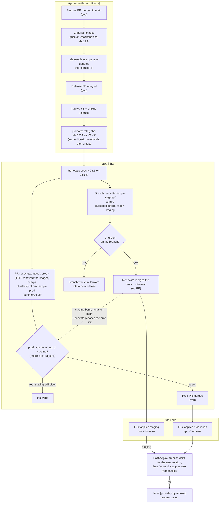
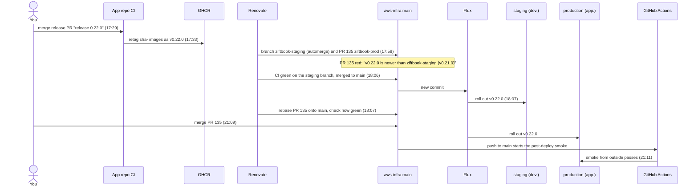

# Release flow: staging, then production

How a change in an app repo (`tbd`, `ziftbook`) reaches staging and then production. This page explains the flow.
The settings each step depends on, and what to check when one breaks, are in
[configuration-map.md, Release and deploy chain](configuration-map.md#release-and-deploy-chain).

## The model in four sentences

1. **Build once.** Every merge to an app's `main` builds images tagged `sha-<7>`. A release never rebuilds: it adds
   the tag `vX.Y.Z` to the image that was already built and tested.
2. **A release is not a deploy.** Deploying means changing an image tag in this repo (`clusters/platform/<app>-<env>/`).
   Flux applies whatever `main` of aws-infra says, so git is the record of what runs where (Flux in Argo CD terms:
   [runbooks.md, Follow Flux and rollouts](runbooks.md#follow-flux-and-rollouts)).
3. **Staging follows releases on its own.** Renovate sees the new tag and moves the staging manifests to it, with no PR
   and no human. Proven for Ziftbook (v0.22.0); configured the same for TBD (INFRA-91) but not yet run by a TBD release.
4. **Production moves only by a PR you merge**, and a CI check holds that PR until staging runs the same version.

You touch three things per release: the feature PR, the release PR, and the production PR. Everything between them is
automatic.

## End to end

## A release, in time order

The first Ziftbook promotion to production (v0.22.0, 2026-10-06, times UTC): 38 minutes from the release PR merge to
a green production PR. Most of it is Renovate: the hosted app runs on its own schedule (here 25 minutes after the
retag); ticking "run again" on the Dependency Dashboard issue forces a run. After that, Flux picks up a merge to `main`
within about a minute, and the post-deploy smoke waits up to 15 minutes for the new version. Production moved when the
PR was merged:

## Who does what

| Step | Who | Where |
|---|---|---|
| Merge the feature PR | You | App repo |
| Build `sha-` images, keep the release PR up to date | CI, release-please | App repo |
| Merge the release PR | You | App repo, PR titled `chore(main): release X.Y.Z` |
| Tag, GitHub release, retag images as `vX.Y.Z`, release smoke | CI | App repo |
| Bump staging and merge it | Renovate (branch automerge) | aws-infra, branch `renovate/<app>-staging-*` |
| Roll out staging | Flux | Cluster, `<app>-staging` |
| Open the production bump PR | Renovate | aws-infra, branch `renovate/ziftbook-prod-*` (TBD: `renovate/tbd-images`) |
| Hold it until staging runs the version | CI, `prod tags not ahead of staging`; Renovate rebases the PR once the staging bump is on `main` (if it has not yet, use Update branch) | aws-infra |
| Merge the production PR | You | aws-infra |
| Roll out production, smoke it from outside | Flux, post-deploy smoke | Cluster, `<app>-prod`; GitHub Actions |

Only `feat`, `fix`, `perf`, `revert` and breaking-change commits make a release (Renovate's `fix(deps)` bumps of
runtime dependencies count as `fix`). A merge of `chore`, `docs`, `ci` and similar types alone never opens a release PR.

## What stops a bad release

| Guard | Catches | Where |
|---|---|---|
| PR checks in the app repo | Failing tests, lint, types, image build | App repo branch protection |
| Build once, retag | "Works in staging, different binary in prod": both run the same image digest | `promote-release@v1` |
| Release smoke | A release image that does not start or does not answer on its health endpoint | App repo release job |
| Staging first | A version reaching production before staging ran it | `check-prod-tags.py` in `Kubernetes checks` |
| Grouped bumps | Backend, worker, migrations and frontend on different versions | Renovate `groupName` per environment |
| Migrations as an init container | A backend starting against an old schema | Each app's `backend.yaml` |
| Post-deploy smoke | A rollout that does not converge, a frontend that does not answer, a database the app cannot reach | `post-deploy-smoke.yml`, one issue per namespace |
| Drift probe | A release that never reached production (an unmerged prod PR, a Renovate miss) | `release-drift-probe.yml`, daily `[release-drift]` issue |

What the staging-first check does **not** do: it compares tags in git, not what staging actually runs. Staging's own
health endpoint and the post-deploy smoke cover that (the smoke runs for `tbd-prod`, `tbd-staging` (version and frontend only), `ziftbook-staging` and
`ziftbook-prod`). Admins can merge a red PR through the ruleset bypass, so treat red as
"not yet", never as noise.

## When something goes wrong

- **Staging bump fails CI:** the branch is not merged and nothing deploys. Fix it in the app and release again
  (fix forward). The next release replaces the stuck branch.
- **Staging runs but is broken:** do not merge the production PR. Fix forward with a new release. To keep a broken
  release out of the drift watch, mark its GitHub release as a prerelease.
- **Production is broken after a merge:** prefer fixing forward. For an urgent rollback, revert the production bump
  commit in aws-infra by PR (the older tag is still on GHCR, so Flux rolls back within minutes). A rollback across a
  migration also needs the schema to accept the older code; check the release notes before reverting.
- **Post-deploy smoke issue opened:** it names the failed step (converge, frontend or app smoke). The next full pass
  closes it. To re-run by hand: Actions > Post-deploy Smoke > Run workflow > namespace.

## Where the pieces live

| Piece | Location |
|---|---|
| Release rules for every app | [`RELEASE_CONTRACT.md`](https://github.com/fjcloudaiconsulting/.github/blob/main/RELEASE_CONTRACT.md), shared workflows `build-image@v1`, `promote-release@v1` |
| Renovate rules (staging automerge, production PR) | [`renovate.json`](../renovate.json) |
| Staging-first check | [`.github/scripts/check-prod-tags.py`](../.github/scripts/check-prod-tags.py) |
| Post-deploy smoke | [`.github/workflows/post-deploy-smoke.yml`](../.github/workflows/post-deploy-smoke.yml), [runbook](runbooks.md#post-deploy-smoke) |
| Manifests per environment | `clusters/platform/<app>-staging/`, `clusters/platform/<app>-prod/` |
| Promotion step by step (TBD) | [runbooks.md, Promote a TBD release](runbooks.md#promote-a-tbd-release-staging-then-production) |
| Settings per step and symptoms | [configuration-map.md](configuration-map.md#release-and-deploy-chain) |

Not covered yet: the post-deploy smoke for `tbd-staging` (INFRA-135).
